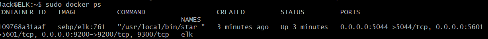
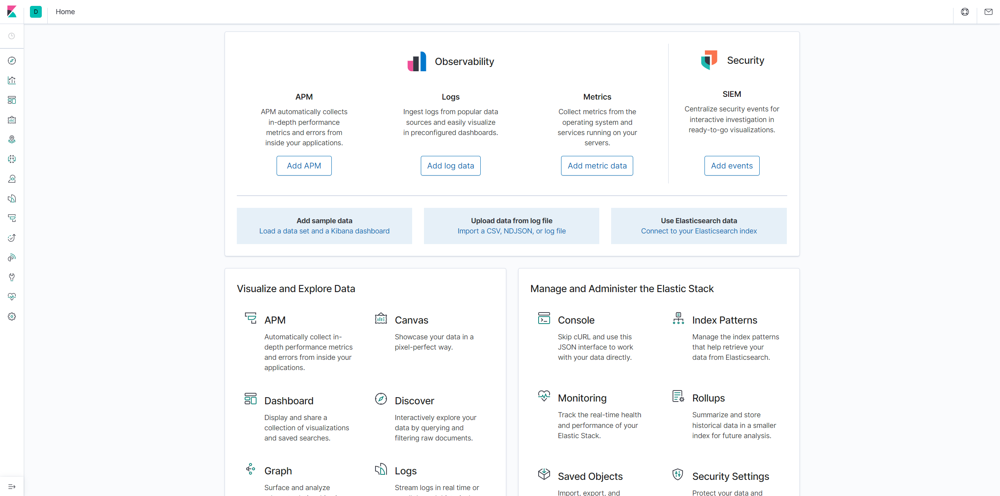

## Automated ELK Stack Deployment

The files in this repository were used to configure the network depicted below.


These files have been tested and used to generate a live ELK deployment on Azure. They can be used to either recreate the entire deployment pictured above. Alternatively, select files may be used to install only certain pieces of it, such as Filebeat.

This document contains the following details:

- Description of the Topology
- Access Policies
- ELK Configuration
  - Beats in Use
  - Machines Being Monitored
- How to Use the Ansible Build

### Description of the Topology

The main purpose of this network is to expose a load-balanced and monitored instance of DVWA, the D\*mn Vulnerable Web Application.

Load balancing ensures that the application will be highly available, in addition to restricting access to the network.

- Load balancers protect the avaibility and access of a network. For example load balancers are useful when protecting against denial of service attacks.

- Using a jump box is helpful because it provides a central machine on the network that can be used to access and manage all the other systems in the network.

Integrating an ELK server allows users to easily monitor the vulnerable VMs for changes to the files and system logs.

- Filebeat watches for changes to files on the machine
- Metricbeat records system proccesses from both services running on the server and the operating system.

The configuration details of each machine may be found below.

| Name     | Function   | IP Address | Operating System |
| -------- | ---------- | ---------- | ---------------- |
| Jump Box | Gateway    | 10.0.0.1   | Linux            |
| Web-1    | Webserver  | 10.0.0.5   | Linux            |
| Web-2    | Webserver  | 10.0.0.6   | Linux            |
| ELK      | Monitoring | 10.1.0.4   | Linux            |

### Access Policies

The machines on the internal network are not exposed to the public Internet.

Only the Jump Box machine can accept connections from the Internet. Access to this machine is only allowed from the following IP addresses:

- Workstation Public IP port 5601

Machines within the network can only be accessed by the Workstation Machine and the Jump Box.

- Machines with access to the ELK VM:
  - Jump Box: 10.0.0.1 port 22
  - Workstation: Public IP port 5601

A summary of the access policies in place can be found in the table below.

| Name     | Publicly Accessible | Allowed IP Addresses                          |
| -------- | ------------------- | --------------------------------------------- |
| Jump Box | Yes                 | Workstation Public IP Port 22                 |
| Web-1    | No                  | 10.0.0.1 Port 22                              |
| Web-2    | No                  | 10.0.0.1 Port 22                              |
| ELK      | No                  | 10.0.0.1 Port 22 and Workstation IP Port 5601 |

### Elk Configuration

Ansible was used to automate configuration of the ELK machine. No configuration was performed manually, this way other ELK machines can be deployed with little effort.

- The main advantage of automating the deployment of ELK machines using ansible is that it allows for the deployment of a reliable and efficient ELK server with very little overhead.

The playbook implements the following tasks:

- Installs docker.io

```yml
- name: Install docker.io
      apt:
        update_cache: yes
        force_apt_get: yes
        name: docker.io
        state: present
```

- Installs pip3 to install docker module

```yml
- name: Install python3-pip
      apt:
        force_apt_get: yes
        name: python3-pip
        state: present

  # Use pip module (It will default to pip3)
    - name: Install Docker module
      pip:
        name: docker
        state: present
```

- Increases virtual memory

```yml
 - name: Increase virtual memory
      command: sysctl -w vm.max_map_count=262144

      # Use sysctl module
    - name: vm.max_map_count
      sysctl:
        name: vm.max_map_count
        value: "262144"
        state: present
        reload: yes
```

- Downloads and launches a docker ELK container

```yml
 - name: download and launch a docker elk container
      docker_container:
        name: elk
        image: sebp/elk:761
        state: started
        restart_policy: always
        # Please list the ports that ELK runs on
        published_ports:
          - 5601:5601
          - 9200:9200
          - 5044:5044
```

- Enables the docker container to run on boot

```yml
 - name: Enable service docker on boot
      systemd:
        name: docker
        enabled: yes
```

The following screenshot displays the result of running `docker ps` after successfully configuring the ELK instance.



### Target Machines & Beats

This ELK server is configured to monitor the following machines:

- Web-1 10.0.0.5
- Web-2 10.0.0.6

We have installed the following Beats on these machines:

- Metricbeat
- Filebeat

These Beats allow us to collect the following information from each machine:

- Metricbeat monitors data from the system and services running on the server. Data that can be expected to be tracked from metricbeat would include CPU and memory usage according to what services are running.

- Filebeat collects data on log files and other locations if specified, when going through data collected by filebeat you would expect to see data on log events including things such as time and date of the change and what changes were made to the files.

### Using the Playbook

In order to use the playbook, you will need to have an Ansible control node already configured. Assuming you have such a control node provisioned:

SSH into the control node and follow the steps below:

- Copy the [install-elk.yml](Ansible/install-elk.yml) file to the ansible control node. (If you want [filebeat](Ansible/filebeat-config.yml) and/or [metricbeat](Ansible/metricbeat-config.yml) make sure to copy those files as well.)

- Using my files:

```bash
mkdir Elk-Deployment
git clone https://github.com/Maximum27/ELK-Stack-Deployment.git
cd /etc/ansible
cp Elk-Deployment/ELK-Stack-Deployment/Ansible/install-elk.yml
cp Elk-Deployment/ELK-Stack-Deployment/Ansible/host.yml
# make sure to copy the filebeat and/or metricbeat files if you want those as well. Just change install-elk.yml to either metricbeat-config.yml or filebeat-config.yml.
```

- Using public download (only availble for filebeat and metricbeat):

```bash
#filebeat
curl -L -O https://gist.githubusercontent.com/slape/5cc350109583af6cbe577bbcc0710c93/raw/eca603b72586fbe148c11f9c87bf96a63cb25760/Filebeat > /etc/ansible/filebeat-config.yml
#metricbeat
curl -L -O https://gist.githubusercontent.com/slape/58541585cc1886d2e26cd8be557ce04c/raw/0ce2c7e744c54513616966affb5e9d96f5e12f73/metricbeat > /etc/ansible/files/metricbeat-config.yml
```

- If used make sure to update metricbeat and filebeat config files (Filebeat: line #1092 | Metricbeat line #130)

```yml
output.elasticsearch:
# Change the hosts IP address to the IP address of your ELK server keep port 9200
hosts: ["10.2.0.4:9200"]
username: "elastic"
password: "changeme"
```

- Change host IP to ELK server IP keep port 5601 (Fiebeat: line #1799 | Metricbeat line #86)

```yml
setup.kibana:
host: "10.2.0.4:5601"
```

- Update the hosts.yml file to include the IP addresses for the webservers and the ELK server.

```yml
[webservers]
10.1.0.5 ansible_python_interpreter=/usr/bin/python3
10.1.0.6 ansible_python_interpreter=/usr/bin/python3


[elk]
10.2.0.4 ansible_python_interpreter=/usr/bin/python3
```

- Run the playbook, and navigate to Kibana (http://[Host IP]/app/kibana#/home) to check that the installation worked as expected. (Note: It may also be worth it to ssh into your ELK server and run `docker ps` to make sure your ELK container is running. To see expected result scroll back up to the bottom of the ELK Configuration section)

```bash
cd /etc/ansible
ansible-playbook install_elk.yml
#ansible-playbook filebeat-config.yml
#ansible-playbook metricbeat-config.yml
```

- Start ELK server

```bash
ssh [username]@10.1.0.4
#Switch to root user
sudo su
#Check to see if the container is on
docker container list -a
#if not then run
docker start elk
```


